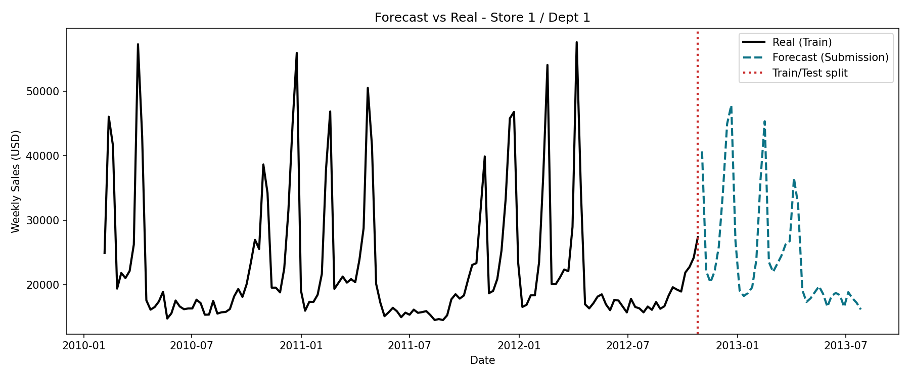
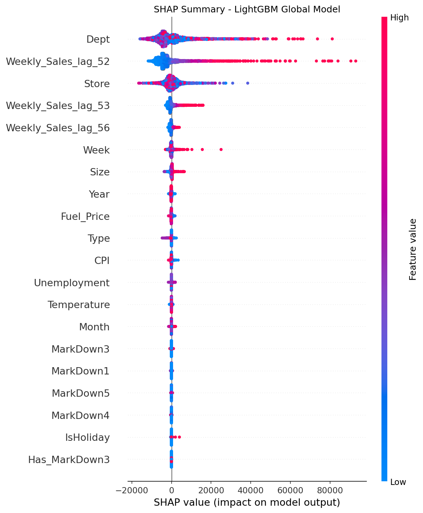

# Store Sales Time Series Forecasting


Proyecto de forecasting para la competencia Kaggle Walmart Recruiting - Store Sales Forecasting.

El objetivo es predecir ventas semanales (Weekly_Sales) para combinaciones Store-Dept, optimizando la metrica oficial WMAE (peso 5x en semanas holiday).

## Resultados Principales

### Modelos Probados

1. Baseline de series temporales y combinaciones simples.
2. LightGBM global con features temporales y lags estacionales.
3. XGBoost global con las mismas features.
4. Ensemble ponderado (mejor resultado en validacion).

| Modelo                     | WMAE Validacion |
|----------------------------|-----------------|
| Baseline (Seasonal Naive)  | ~3,200          |
| LightGBM global            | 1,822.40        |
| XGBoost global             | 1,846.81        |
| **Blend LGB+XGB (w=0.60)** | **1,802.33**    |  <---- Modelo seleccionado

Fuente: outputs/model_comparison.csv

### Resultados de Kaggle

- Kaggle Public Score: 2,829.48   <---- Score final obtenido

## Hallazgos Clave de EDA

1. Fuertes picos de ventas en semanas holiday (especialmente Thanksgiving y Christmas).
2. MarkDown1-5 presenta alto nivel de nulos y disponibilidad parcial historica.
3. Alta heterogeneidad entre tiendas y departamentos (series con distintos niveles y volatilidad).
4. El leakage temporal en lags cortos puede inflar artificialmente el score de validacion.

## Estructura del Proyecto

- notebooks/
  - 01_EDA.ipynb: Analisis exploratorio.
  - 02_Feature_Engineering.ipynb: Feature engineering y control de leakage.
  - 03_Modelado_LightGBM_y_XGBoost.ipynb: Entrenamiento y validacion.
  - 04_Test_Submission.ipynb: Entrenamiento final y generacion de submission.
  - 05_Interpretabilidad_y_Explicabilidad.ipynb: Analisis de importancia y explicabilidad.
- models/
  - lightgbm_final.txt
  - xgboost_final.json
  - ensemble_weights.txt
- outputs/
  - submission.csv
  - model_comparison.csv
  - weights_search.csv
  - figures/
    - forecast_vs_real_store1_dept1.png
    - shap_summary_lightgbm.png

## Instalacion

```bash
python -m venv .venv
# Windows
.venv\Scripts\activate

# Linux / Mac
source .venv/bin/activate

pip install -r requirements.txt
```

## Datos

Descargar los archivos desde Kaggle y colocarlos en data/raw/:

- train.csv
- test.csv
- features.csv
- stores.csv
- sampleSubmission.csv

Kaggle: https://www.kaggle.com/c/walmart-recruiting-store-sales-forecasting/data

## Como Correr el Proyecto End-to-End

1. Preparar entorno e instalar dependencias.
2. Ejecutar notebooks en este orden:
   - notebooks/01_EDA.ipynb
   - notebooks/02_Feature_Engineering.ipynb
   - notebooks/03_Modelado_LightGBM_y_XGBoost.ipynb
   - notebooks/04_Test_Submission.ipynb
   - notebooks/05_Interpretabilidad_y_Explicabilidad.ipynb
3. Revisar outputs/model_comparison.csv para comparar modelos.
4. Revisar outputs/submission.csv como archivo final para Kaggle.
5. Revisar outputs/figures para evidencias visuales.

## Evidencias Visuales

### Forecast vs Real (Serie Representativa)



### SHAP Values (Modelo LightGBM Global)



## Notas de Reproducibilidad

- La validacion final reportada evita leakage temporal usando lags estacionales seguros.
- Todas las predicciones finales se clippean para asegurar no negatividad (Weekly_Sales >= 0).
